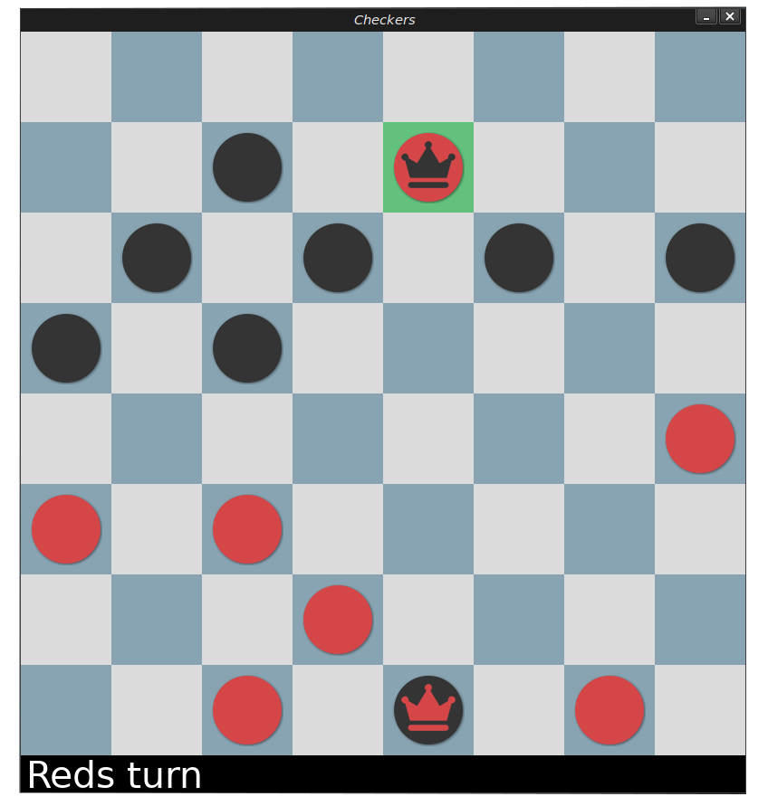

# checkersAI
Play checkers against your computer that uses basic [Minimax](https://en.wikipedia.org/wiki/Minimax) algorithm.

  

while still in beta, code became bit messy and i am planning to refactor in the future, also performance can be improved and more features can be added.
such as, using better heuristics, [Alpha-beta pruning](https://en.wikipedia.org/wiki/Alpha%E2%80%93beta_pruning), etc..
